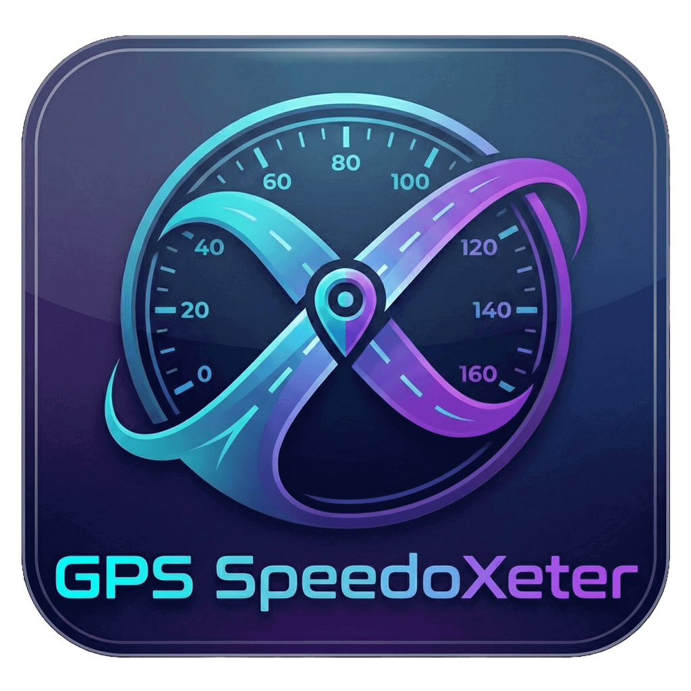

#  Trip MetriX

Trip MetriX is your ultimate companion for vehicle management and trip tracking. Designed for simplicity and performance, it helps you keep a detailed log of your journeys and manage your vehicle garage with ease.

## Key Features

- **Track Your Trips**: Automatically record your trips with real-time GPS tracking. Monitor your distance, duration, and speed as you drive.
- **My Garage**: Keep all your vehicles in one place. Add cars or bikes, give them nicknames, and track trips specifically for each vehicle.
- **Detailed History**: Access a comprehensive history of all your past trips. View route maps, start/end addresses, and performance statistics.
- **Trip Management**: Easily delete unwanted trips or export your trip data to CSV for external analysis.
- **Insightful Statistics**: Get insights into your driving habits with monthly and overall statistics for distance covered, time spent driving, and average speeds.
- **Personalized Experience**: Enjoy a sleek interface with support for both Dark and Light modes, customizable with your preferred accent colors.

## How to Use

1.  **Add a Vehicle**: Go to **Settings > My Garage** and add your vehicles.
2.  **Start a Trip**: On the home screen, select your vehicle and tap **Start Trip**.
3.  **View History**: Navigate to the **History** tab to see your past journeys. Tap on any trip for more details.
4.  **Manage Data**: Use the **Settings** menu to customize the app appearance or export your data.

---

## Developer Guide

If you are a developer and want to customize or build this project on your own, follow these steps:

### Prerequisites
- Node.js
- npm or yarn
- Expo Go app on your mobile device

### Setup & Installation

1.  **Clone the Repository**:
    Clone this project to your local machine.

2.  **Navigate to Source**:
    The source code is located in the `src` folder.
    ```bash
    cd src
    ```

3.  **Install Dependencies**:
    ```bash
    npm install
    ```

4.  **Run the App**:
    Start the development server.
    ```bash
    npx expo start
    ```
    - Scan the QR code with the Expo Go app on Android.
    - For iOS, use the Camera app to scan the QR code.
